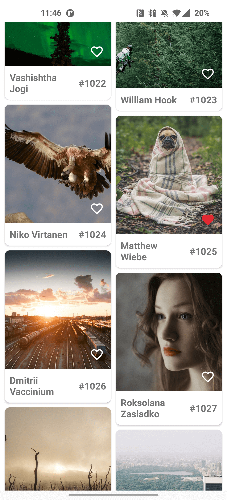

## This is an example project using
- Retrofit
- Room Database
- Hilt Dependency Injection
- MVVM Architecture
- FileProvider
- Paging 3
- ListAdapter 
- Navigation, single Activity architecture
- SafeArgs
- Api rest

## Figma
[Screen design](https://www.figma.com/file/WSW9gIGImrVyHbWzcGUwja/Lorem-Picsum-API?node-id=0%3A1)

## Lorem Picsum API
[Lorem Picsum API](https://picsum.photos/)

List Images

```sh
[
    {
        "id": "0",
        "author": "Alejandro Escamilla",
        "width": 5616,
        "height": 3744,
        "url": "https://unsplash.com/...",
        "download_url": "https://picsum.photos/..."
    }
]
```

## Acknowledgements
* [Hilt dependency injection](https://developer.android.com/training/dependency-injection/hilt-android)

* [Navigation](https://developer.android.com/guide/navigation)

* [Safeargs](https://developer.android.com/guide/navigation/navigation-pass-data)

* [Kotlin Coroutines](https://developer.android.com/kotlin/coroutines)

* [MVVM Architecture](https://developer.android.com/jetpack/guide)

* [LiveData](https://developer.android.com/topic/libraries/architecture/livedata)

* [Paging 3](https://developer.android.com/topic/libraries/architecture/paging/v3-overview)

* [ListAdapter](https://developer.android.com/topic/libraries/architecture/paging/v3-overview)

* [DiffUtil](https://developer.android.com/reference/androidx/recyclerview/widget/DiffUtil)

* [ViewBinding](https://developer.android.com/topic/libraries/view-binding)

* [Lifecycle](https://developer.android.com/guide/components/activities/activity-lifecycle)

* [Runtime Permissions](https://developer.android.com/training/permissions/requesting)

* [Room](https://developer.android.com/training/data-storage/room)

* [Shared Preferences](https://developer.android.com/training/data-storage/shared-preferences)

* [Retrofit](https://square.github.io/retrofit/)

* [FileProvider](https://developer.android.com/reference/androidx/core/content/FileProvider)

## Screens
</img>
</img>
</img>
</img>
</img>
</img>
</img>
